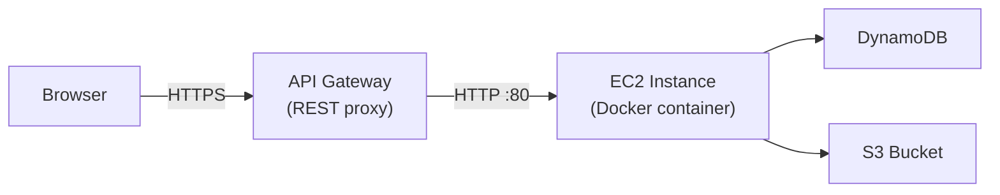
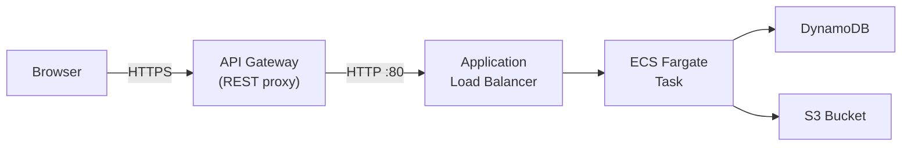
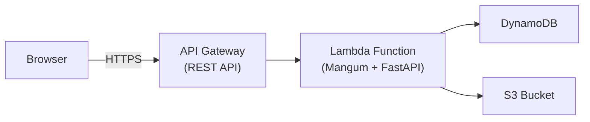
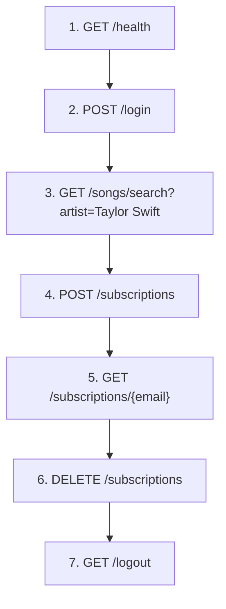

# Music Subscription Backend and Frontend — Deployment, Probing & Teardown Guide

> [!NOTE]
> This guide covers the **3 backend deployments** (EC2, ECS Fargate, API Gateway + Lambda) and the static frontend in [frontend/](frontend/). All work happens inside the **AWS Learner Lab** browser console in **`us-east-1`**.

---

## Table of Contents

1. [Project-Spec Analysis](#project-spec-analysis)
2. [Shared Prerequisites](#shared-prerequisites)
3. [Backend 1 — EC2 (Container on a VM)](#backend-1--ec2-container-on-a-vm)
4. [Backend 2 — ECS Fargate (Managed Containers)](#backend-2--ecs-fargate-managed-containers)
5. [Frontend — Static Web App](#frontend--static-web-app)
6. [Backend 3 — API Gateway + Lambda (Serverless)](#backend-3--api-gateway--lambda-serverless)
7. [API Probing Cheat-Sheet (browser-friendly)](#api-probing-cheat-sheet)
8. [Cost-Control Reminders](#cost-control-reminders)

---

## Project-Spec Analysis

| Spec Requirement | Implementation Status |
|---|---|
| Q1 – Login table (10 entities, email/user_name/password) | ✅ [q1_create_login.py](file:///e:/rmit/y2s2/cloud-computing/full-stack-music-subscription.worktrees/dockerizing-new/q1_create_login.py) |
| Q2 – Music table (title, artist, year, album, image_url) | ✅ [q2_create_music.py](file:///e:/rmit/y2s2/cloud-computing/full-stack-music-subscription.worktrees/dockerizing-new/q2_create_music.py) — PK=`title`, SK=`album` |
| Q3 – Load 2026a2_songs.json losslessly | ✅ [q3_load_music.py](file:///e:/rmit/y2s2/cloud-computing/full-stack-music-subscription.worktrees/dockerizing-new/q3_load_music.py) — dedup check via `get_item` before write |
| Q4 – Download & upload artist images to S3 | ✅ [q4_S3_images.py](file:///e:/rmit/y2s2/cloud-computing/full-stack-music-subscription.worktrees/dockerizing-new/q4_S3_images.py) — bucket `rmit-music-images-unique-91725` |
| Frontend — static app in its own directory | ✅ [frontend/](frontend/) — login/register/main/search/subscriptions UI |
| GSI required | ✅ `ArtistYearIndex` (artist PK, year SK) in [q2_create_music.py](file:///e:/rmit/y2s2/cloud-computing/full-stack-music-subscription.worktrees/dockerizing-new/q2_create_music.py) |
| LSI required | ⚠️ `TitleYearIndex` is **commented out** in q2_create_music.py — spec mandates at least one LSI |
| Both Query and Scan used | ✅ [music.py](file:///e:/rmit/y2s2/cloud-computing/full-stack-music-subscription.worktrees/dockerizing-new/app/routers/music.py) — Query on base table, Query on GSI, Scan fallback |
| RESTful API (GET, POST, DELETE) | ✅ GET `/songs/search`, `/subscriptions/{email}`, `/health`, `/logout`; POST `/login`, `/register`, `/songs/search`, `/subscriptions`; DELETE `/subscriptions`, `/logout` |
| S3 presigned URLs for images | ✅ [db.py](file:///e:/rmit/y2s2/cloud-computing/full-stack-music-subscription.worktrees/dockerizing-new/app/db.py) `create_presigned_image_url()` |
| Subscriptions table | ✅ [create_subscriptions_table.py](file:///e:/rmit/y2s2/cloud-computing/full-stack-music-subscription.worktrees/dockerizing-new/create_subscriptions_table.py) — PK=`user_email`, SK=`music_id` |
| LabRole / LabInstanceProfile used | ✅ All deploy scripts reference `LabRole`/`LabInstanceProfile` |
| Port 80/443 | ✅ Dockerfile EXPOSE 80, user_data.sh `-p 80:80`, task-definition.json `containerPort: 80` |
| Elastic Beanstalk NOT used | ✅ Not used anywhere |
| 3 independent backends | ✅ EC2 + API GW proxy, ECS Fargate + API GW proxy, API GW + Lambda (SAM) |

> [!WARNING]
> The LSI (`TitleYearIndex`) is currently commented out in `q2_create_music.py`. The spec explicitly requires **at least one GSI and one LSI**. You should uncomment it before creating the music table, or recreate the table with it enabled. LSIs can only be defined at table creation time.

> [!NOTE]
> The frontend is a static site under [frontend/](frontend/). It talks to the backend over HTTP(S), so if you host it on a different origin, keep the backend CORS settings enabled and point the frontend `apiBaseUrl` at the backend URL you deployed.

---

## Shared Prerequisites

These steps must be completed **once** before any of the 3 backends can function. Run them from **CloudShell** or an **EC2 Instance Connect** terminal inside the Learner Lab.

### P1. Start the Learner Lab session

1. Open **AWS Academy → Learner Lab** in your browser.
2. Click **Start Lab** — wait for the indicator to turn green.
3. Click **AWS** to open the AWS Console. Verify you are in **us-east-1** (N. Virginia).

### P2. Note your Account ID and LabRole ARN

```bash
# In CloudShell:
aws sts get-caller-identity --query Account --output text
# → your 12-digit ACCOUNT_ID

aws iam get-role --role-name LabRole --query Role.Arn --output text
# → arn:aws:iam::<ACCOUNT_ID>:role/LabRole
```

Write these down — every deploy step below references `<ACCOUNT_ID>` and `<LABROLE_ARN>`.

### P3. Create DynamoDB tables and S3 bucket (if not already done)

If the tables and bucket already exist from a prior session, skip this. Otherwise clone the repo into CloudShell and run:

```bash
# Clone repo (or upload a zip)
git clone <YOUR_REPO_URL> music-app && cd music-app

# Install deps
pip3 install boto3 tqdm requests

# Create tables & load data
python3 q1_create_login.py
python3 q2_create_music.py
python3 q3_load_music.py
python3 create_subscriptions_table.py
python3 q4_S3_images.py
```

> [!TIP]
> You can verify tables exist with:
> ```bash
> aws dynamodb list-tables --region us-east-1
> aws dynamodb scan --table-name login --select COUNT --region us-east-1
> aws dynamodb scan --table-name music --select COUNT --region us-east-1
> aws s3 ls s3://rmit-music-images-unique-91725/
> ```

### P4. Create ECR repository (shared by EC2 and ECS deployments)

```bash
aws ecr create-repository \
  --repository-name music-subscription-api \
  --region us-east-1
```

> [!NOTE]
> If it already exists, this will error — that's fine, move on.

### P5. Build and push the Docker image to ECR

You need a Docker-capable environment. **CloudShell does NOT have Docker**. Options:
- **Option A** — Build locally on your Windows machine and push (requires AWS CLI configured with Learner Lab creds + Docker Desktop running).
- **Option B** — Launch a temporary EC2 instance (Amazon Linux 2, `t2.small`, attach `LabInstanceProfile`), SSH/Instance Connect in, clone repo, install Docker, build & push.

Below assumes **Option A** (local machine with Docker Desktop):

```powershell
# 1. Get Learner Lab temporary credentials and configure AWS CLI locally
#    (copy AWS_ACCESS_KEY_ID, AWS_SECRET_ACCESS_KEY, AWS_SESSION_TOKEN
#     from Learner Lab → "AWS Details" → "AWS CLI")
$env:AWS_ACCESS_KEY_ID = "<paste>"
$env:AWS_SECRET_ACCESS_KEY = "<paste>"
$env:AWS_SESSION_TOKEN = "<paste>"
$env:AWS_DEFAULT_REGION = "us-east-1"

# 2. Get your Account ID
$ACCOUNT_ID = aws sts get-caller-identity --query Account --output text

# 3. ECR login
aws ecr get-login-password --region us-east-1 | docker login --username AWS --password-stdin "$ACCOUNT_ID.dkr.ecr.us-east-1.amazonaws.com"

# 4. Build image (from project root)
docker build -t music-subscription-api:latest .

# 5. Tag for ECR
docker tag music-subscription-api:latest "${ACCOUNT_ID}.dkr.ecr.us-east-1.amazonaws.com/music-subscription-api:latest"

# 6. Push
docker push "${ACCOUNT_ID}.dkr.ecr.us-east-1.amazonaws.com/music-subscription-api:latest"
```

> [!IMPORTANT]
> The image must be **linux/amd64** architecture. If you're on an ARM Mac, add `--platform linux/amd64` to the `docker build` command. On Windows/Intel, the default is correct.

---

## Frontend — Static Web App

The frontend is a plain HTML/CSS/JS app in [frontend/](frontend/). It is intentionally separate from the backend so it can be hosted with the simplest and cheapest static hosting option you prefer.

### Architecture & Deployment Options

```mermaid
graph LR
    User -->|HTTPS| Frontend["Frontend<br/>(Static HTML/CSS/JS)"]
    Frontend -->|HTTP(S)| API["Backend API<br/>(EC2/ECS/Lambda)"]
    Frontend -->|Config:<br/>apiBaseUrl| ConfigJS["config.js<br/>or Query Param<br/>or localStorage"]
    ConfigJS -->|Points to| API
```

| Hosting Option | Cost | Setup | Recommended For |
|---|---|---|---|
| **Local Python server** | Free | `python -m http.server 5173` | Local development & testing |
| **AWS S3 static website** | $0–1/mo | 5 min; S3 + IAM policy | Testing, demos, low-traffic apps |
| **S3 + CloudFront CDN** | $0–5/mo | 10 min; adds CloudFront distro | Production, global delivery |
| **GitHub Pages** | Free | Push to `gh-pages` branch | Public projects, no AWS needed |
| **Vercel / Netlify** | Free–$20/mo | Connect Git repo | Continuous deployment, modern DX |
| **Simple HTTP server on EC2** | $0–10/mo | 2 min; e.g., `nginx` on existing EC2 | Bundled with backend on same instance |

### Option 1: Local Development

From the project root:

```powershell
cd frontend
python -m http.server 5173
```

Open [http://127.0.0.1:5173](http://127.0.0.1:5173). The frontend will default to `http://127.0.0.1:8000` for the backend API. To override:

```text
http://127.0.0.1:5173/?apiBase=http://127.0.0.1:8000
```

or edit [frontend/config.js](frontend/config.js) directly.

### Option 2: AWS S3 Static Website

#### Step F2.1 — Create & configure S3 bucket

```bash
# 1. Create bucket (bucket names must be globally unique)
BUCKET_NAME="music-subscription-frontend-$(date +%s)"
aws s3 mb s3://$BUCKET_NAME --region us-east-1

# 2. Enable static website hosting
aws s3 website s3://$BUCKET_NAME \
  --index-document index.html \
  --error-document index.html

# 3. Create a bucket policy to allow public read access
aws s3api put-bucket-policy --bucket $BUCKET_NAME --policy '{
  "Version": "2012-10-17",
  "Statement": [{
    "Effect": "Allow",
    "Principal": "*",
    "Action": "s3:GetObject",
    "Resource": "arn:aws:s3:::'"$BUCKET_NAME"'/*"
  }]
}'

# 4. Disable block-all-public-access
aws s3api put-public-access-block \
  --bucket $BUCKET_NAME \
  --public-access-block-configuration \
  "BlockPublicAcls=false,IgnorePublicAcls=false,BlockPublicPolicy=false,RestrictPublicBuckets=false"

# 5. Print the website URL
aws s3api get-bucket-website --bucket $BUCKET_NAME --region us-east-1 --query 'WebsiteConfiguration.IndexDocument' --output text
# → Returns: "index.html" (website URL will be: http://$BUCKET_NAME.s3-website-us-east-1.amazonaws.com)
```

#### Step F2.2 — Update frontend config & upload

Edit [frontend/config.js](frontend/config.js) to set the correct backend URL:

```javascript
window.APP_CONFIG = {
  appName: "Music Subscription",
  apiBaseUrl: "http://<EC2_PUBLIC_DNS>",  // or your backend URL
};
```

Then upload all frontend files:

```bash
aws s3 sync ./frontend s3://$BUCKET_NAME \
  --exclude ".git/*" \
  --exclude "README.md" \
  --exclude "*.md" \
  --region us-east-1
```

#### Step F2.3 — Access the frontend

```text
http://<BUCKET_NAME>.s3-website-us-east-1.amazonaws.com
```

> [!NOTE]
> S3 static websites must be accessed via HTTP, not HTTPS (unless you add CloudFront).

### Option 3: CloudFront CDN in front of S3

For HTTPS and global caching:

```bash
# Create a CloudFront distribution
aws cloudfront create-distribution \
  --origin-domain-name $BUCKET_NAME.s3-website-us-east-1.amazonaws.com \
  --default-root-object index.html \
  --enabled \
  --region us-east-1 | jq '.Distribution.DomainName'
# → Returns CloudFront domain name (e.g., d12345.cloudfront.net)
```

Then access via:

```text
https://d12345.cloudfront.net
```

### Option 4: GitHub Pages (if repo is public)

1. Push the `frontend/` folder to your GitHub repo.
2. In **Settings → Pages**, select "Deploy from a branch" and choose `main` → `/docs` (or create a `.github/workflows/deploy.yml`).
3. Access at `https://<USERNAME>.github.io/<REPO_NAME>/frontend/`.

### Configuring the API base URL for different backends

The frontend resolves the API base URL in this order:
1. **Query parameter:** `?apiBase=<URL>`
2. **localStorage:** Previously saved value from query parameter
3. **config.js default:** `http://127.0.0.1:8000`

**For each backend deployment, update config.js and redeploy:**

| Backend Target | API Base URL |
|---|---|
| **EC2 direct** | `http://<EC2_PUBLIC_DNS>` |
| **EC2 via API Gateway** | `https://<api-id>.execute-api.us-east-1.amazonaws.com/prod` |
| **ECS Fargate via ALB** | `http://<ALB_DNS_NAME>` |
| **ECS Fargate via API Gateway** | `https://<api-id>.execute-api.us-east-1.amazonaws.com/prod` |
| **Lambda via API Gateway** | `https://<api-id>.execute-api.us-east-1.amazonaws.com/prod` |

**Example: deploying for ECS backend**

```bash
# 1. Get ALB DNS name
ALB_DNS=$(aws elbv2 describe-load-balancers \
  --region us-east-1 | \
  jq -r '.LoadBalancers[0].DNSName')

# 2. Update config.js
sed -i "s|apiBaseUrl: \".*\"|apiBaseUrl: \"http://$ALB_DNS\"|" frontend/config.js

# 3. Re-upload to S3
aws s3 sync ./frontend s3://$BUCKET_NAME \
  --exclude ".git/*" --exclude "*.md" \
  --region us-east-1
```

### CORS note

The backend FastAPI app includes permissive CORS middleware (see [app/main.py](app/main.py)) so the static frontend can call it from a separate origin. If you want to narrow allowed origins later, set the `FRONTEND_ORIGINS` environment variable to a comma-separated list:

```bash
# Example: only allow S3-hosted frontend
export FRONTEND_ORIGINS="http://music-subscription-frontend-XXXXX.s3-website-us-east-1.amazonaws.com"
```

### Teardown Frontend

**S3 cleanup:**

```bash
# Remove all objects from bucket
aws s3 rm s3://$BUCKET_NAME --recursive

# Delete bucket
aws s3 rb s3://$BUCKET_NAME

# If using CloudFront, disable and delete the distribution
aws cloudfront list-distributions --region us-east-1 | \
  jq '.DistributionList.Items[] | select(.Origins.Items[0].DomainName | contains($BUCKET_NAME)) | .Id'
# Then: aws cloudfront delete-distribution --id <DIST_ID> --region us-east-1
```

---

## Backend 1 — EC2 (Container on a VM)

### Architecture



### Step 1.1 — Launch the EC2 instance

1. Open **EC2 → Launch Instances** in the AWS Console.
2. Configure:

| Setting | Value |
|---|---|
| Name | `music-subscription-ec2` |
| AMI | Amazon Linux 2023 AMI (or Amazon Linux 2) |
| Instance type | `t2.small` |
| Key pair | `vockey` |
| Network / Security Group | Create new SG: Allow **HTTP (port 80)** from `0.0.0.0/0` and **SSH (port 22)** from your IP |
| IAM instance profile | `LabInstanceProfile` |
| User data | Paste the contents of [user_data.sh](file:///e:/rmit/y2s2/cloud-computing/full-stack-music-subscription.worktrees/dockerizing-new/deploy/ec2/user_data.sh), **after editing** the `ACCOUNT_ID` and `S3_BUCKET_NAME` placeholders |

3. Click **Launch Instance**.

> [!IMPORTANT]
> Before pasting `user_data.sh`, replace:
> - `CHANGE_ME_ACCOUNT_ID` → your 12-digit Account ID
> - `CHANGE_ME_BUCKET` → `rmit-music-images-unique-91725`

### Step 1.2 — Wait for the instance & verify

1. In **EC2 → Instances**, wait for Instance State = **Running** and Status Checks = **2/2 passed**.
2. Copy the **Public IPv4 DNS** (e.g. `ec2-XX-XX-XX-XX.compute-1.amazonaws.com`).
3. In your browser, navigate to:

```
http://<EC2_PUBLIC_DNS>/health
```

Expected response:
```json
{"status": "ok"}
```

> [!TIP]
> If the health check fails, SSH in and check Docker:
> ```bash
> ssh -i vockey.pem ec2-user@<PUBLIC_IP>
> sudo docker ps
> sudo docker logs music-subscription-api
> ```

### Step 1.3 — Deploy API Gateway proxy for EC2

From your **local PowerShell** (with AWS env vars set):

```powershell
pwsh -File .\deploy\apigw\deploy-ec2.ps1 `
  -BackendBaseUrl "http://<EC2_PUBLIC_DNS>"
```

This creates a CloudFormation stack `music-subscription-apigw-ec2` and prints the **API Gateway URL**. Note it down.

### Step 1.4 — Probe EC2 backend APIs

See the [API Probing Cheat-Sheet](#api-probing-cheat-sheet) below. Replace `<BASE_URL>` with either:
- Direct: `http://<EC2_PUBLIC_DNS>`
- Via API GW: `https://<api-id>.execute-api.us-east-1.amazonaws.com/prod`

### Step 1.5 — Teardown EC2

```powershell
# 1. Delete the API Gateway CloudFormation stack
aws cloudformation delete-stack --stack-name music-subscription-apigw-ec2 --region us-east-1

# 2. Terminate the EC2 instance (from console or CLI)
aws ec2 terminate-instances --instance-ids <INSTANCE_ID> --region us-east-1
```

Alternatively, just **stop** the instance to save budget if you need it later (IPs will change on restart unless you use an Elastic IP).

---

## Backend 2 — ECS Fargate (Managed Containers)

### Architecture



### Step 2.1 — Create the ECS cluster (Console)

1. Open **ECS → Clusters → Create Cluster**.
2. Configure:

| Setting | Value |
|---|---|
| Cluster name | `music-subscription-cluster` |
| Infrastructure | **AWS Fargate (serverless)** only |

3. Click **Create**.

### Step 2.2 — Create a CloudWatch Log Group

The task definition references `/ecs/music-subscription-api` for logging:

```bash
aws logs create-log-group \
  --log-group-name /ecs/music-subscription-api \
  --region us-east-1
```

### Step 2.3 — Create networking resources (VPC, Subnets, ALB, Security Groups)

ECS Fargate tasks run in an `awsvpc` network mode and need:
- A **VPC** with at least **2 public subnets** in different AZs (the default VPC works).
- A **Security Group** for the ECS tasks allowing inbound **port 80**.
- An **Application Load Balancer (ALB)** in those subnets, with a **Target Group** (type = `ip`, port 80, health check path `/health`).

**Using the default VPC (quickest path):**

1. **Note your default VPC ID and its public subnet IDs:**

```bash
# Default VPC
aws ec2 describe-vpcs --filters Name=isDefault,Values=true --query "Vpcs[0].VpcId" --output text
# → vpc-xxxxxxxx

# Subnets (pick 2 in different AZs)
aws ec2 describe-subnets --filters Name=vpc-id,Values=<VPC_ID> --query "Subnets[*].[SubnetId,AvailabilityZone]" --output table
```

2. **Create a Security Group for ECS tasks:**

```bash
SG_ID=$(aws ec2 create-security-group \
  --group-name ecs-music-sg \
  --description "ECS music subscription" \
  --vpc-id <VPC_ID> \
  --query GroupId --output text \
  --region us-east-1)

aws ec2 authorize-security-group-ingress \
  --group-id $SG_ID \
  --protocol tcp --port 80 \
  --cidr 0.0.0.0/0 \
  --region us-east-1
```

3. **Create ALB:**

```bash
ALB_ARN=$(aws elbv2 create-load-balancer \
  --name music-subscription-alb \
  --subnets <SUBNET_1> <SUBNET_2> \
  --security-groups $SG_ID \
  --scheme internet-facing \
  --type application \
  --query "LoadBalancers[0].LoadBalancerArn" --output text \
  --region us-east-1)
```

4. **Create Target Group:**

```bash
TG_ARN=$(aws elbv2 create-target-group \
  --name music-sub-tg \
  --protocol HTTP --port 80 \
  --vpc-id <VPC_ID> \
  --target-type ip \
  --health-check-path /health \
  --query "TargetGroups[0].TargetGroupArn" --output text \
  --region us-east-1)
```

5. **Create ALB Listener:**

```bash
aws elbv2 create-listener \
  --load-balancer-arn $ALB_ARN \
  --protocol HTTP --port 80 \
  --default-actions Type=forward,TargetGroupArn=$TG_ARN \
  --region us-east-1
```

6. **Get ALB DNS name:**

```bash
aws elbv2 describe-load-balancers \
  --load-balancer-arns $ALB_ARN \
  --query "LoadBalancers[0].DNSName" --output text \
  --region us-east-1
# → music-subscription-alb-XXXXXXXXX.us-east-1.elb.amazonaws.com
```

### Step 2.4 — Deploy the ECS service using the deploy script

From your **local PowerShell** (with AWS env vars + Docker Desktop running):

```powershell
pwsh -File .\deploy\ecs\deploy.ps1 `
  -AccountId <ACCOUNT_ID> `
  -Cluster music-subscription-cluster `
  -Service music-subscription-service `
  -LabRoleArn "arn:aws:iam::<ACCOUNT_ID>:role/LabRole" `
  -Bucket rmit-music-images-unique-91725 `
  -Region us-east-1
```

> [!NOTE]
> This script builds & pushes the Docker image, registers a new task definition, and updates the ECS service. **If the ECS service doesn't exist yet**, you must create it first (see below).

**Create the ECS service (first time only):**

```bash
aws ecs create-service \
  --cluster music-subscription-cluster \
  --service-name music-subscription-service \
  --task-definition music-subscription-api \
  --desired-count 1 \
  --launch-type FARGATE \
  --network-configuration "awsvpcConfiguration={subnets=[<SUBNET_1>,<SUBNET_2>],securityGroups=[$SG_ID],assignPublicIp=ENABLED}" \
  --load-balancers "targetGroupArn=$TG_ARN,containerName=music-subscription-api,containerPort=80" \
  --region us-east-1
```

### Step 2.5 — Verify ECS deployment

1. In **ECS → Clusters → music-subscription-cluster → Services**, check the service is **ACTIVE** with 1 running task.
2. Browse to:

```
http://<ALB_DNS_NAME>/health
```

Expected: `{"status": "ok"}`

### Step 2.6 — Deploy API Gateway proxy for ECS

```powershell
pwsh -File .\deploy\apigw\deploy-ecs.ps1 `
  -BackendBaseUrl "http://<ALB_DNS_NAME>"
```

Note the API Gateway URL printed at the end.

### Step 2.7 — Probe ECS backend APIs

See the [API Probing Cheat-Sheet](#api-probing-cheat-sheet). Replace `<BASE_URL>` with either:
- Direct via ALB: `http://<ALB_DNS_NAME>`
- Via API GW: `https://<api-id>.execute-api.us-east-1.amazonaws.com/prod`

### Step 2.8 — Teardown ECS

```bash
# 1. Delete API Gateway stack
aws cloudformation delete-stack --stack-name music-subscription-apigw-ecs --region us-east-1

# 2. Scale service to 0, then delete it
aws ecs update-service --cluster music-subscription-cluster --service music-subscription-service --desired-count 0 --region us-east-1
aws ecs delete-service --cluster music-subscription-cluster --service music-subscription-service --force --region us-east-1

# 3. Delete ALB listener, target group, and load balancer
aws elbv2 delete-load-balancer --load-balancer-arn $ALB_ARN --region us-east-1
# (wait ~30s for ALB to drain)
aws elbv2 delete-target-group --target-group-arn $TG_ARN --region us-east-1

# 4. Delete security group
aws ec2 delete-security-group --group-id $SG_ID --region us-east-1

# 5. Delete cluster (only if empty)
aws ecs delete-cluster --cluster music-subscription-cluster --region us-east-1

# 6. Delete log group
aws logs delete-log-group --log-group-name /ecs/music-subscription-api --region us-east-1
```

> [!CAUTION]
> ALB and NAT Gateway are the biggest cost items for ECS. **Always tear them down when not in use.**

---

## Backend 3 — API Gateway + Lambda (Serverless)

### Architecture



### Step 3.1 — Install AWS SAM CLI

If not already installed, install the [AWS SAM CLI](https://docs.aws.amazon.com/serverless-application-model/latest/developerguide/install-sam-cli.html) on your local machine.

```powershell
# Verify
sam --version
```

### Step 3.2 — Build the SAM application

From the project root directory:

```powershell
sam build -t deploy/lambda/template.yaml
```

> [!NOTE]
> SAM will create a `.aws-sam/build/` directory with the packaged Lambda code. It bundles everything under `CodeUri: ../../` (the project root), including `lambda_handler.py`, `app/`, and dependencies from `requirements.txt`.

### Step 3.3 — Deploy with SAM

```powershell
sam deploy `
  --stack-name music-subscription-lambda `
  --region us-east-1 `
  --capabilities CAPABILITY_IAM `
  --resolve-s3 `
  --parameter-overrides `
    LabRoleArn="arn:aws:iam::<ACCOUNT_ID>:role/LabRole" `
    S3BucketName="rmit-music-images-unique-91725"
```

> [!IMPORTANT]
> - `--resolve-s3` lets SAM auto-create/use a managed S3 bucket for deployment artifacts.
> - If you get IAM permission errors, try `--no-fail-on-empty-changeset` and verify your Learner Lab session is still active (green indicator).

After deployment, SAM prints the outputs including the API Gateway URL:

```
Outputs
------------------------------------------------------------------------
Key                 ApiUrl
Description         API Gateway URL
Value               https://<api-id>.execute-api.us-east-1.amazonaws.com/prod/
------------------------------------------------------------------------
```

### Step 3.4 — Verify Lambda deployment

Browse to:

```
https://<api-id>.execute-api.us-east-1.amazonaws.com/prod/health
```

Expected: `{"status": "ok"}`

### Step 3.5 — Probe Lambda backend APIs

See the [API Probing Cheat-Sheet](#api-probing-cheat-sheet). Replace `<BASE_URL>` with:
- `https://<api-id>.execute-api.us-east-1.amazonaws.com/prod`

### Step 3.6 — Teardown Lambda

```powershell
sam delete --stack-name music-subscription-lambda --region us-east-1 --no-prompts
```

This deletes the CloudFormation stack, Lambda function, API Gateway, and the deployment S3 bucket.

---

## API Probing Cheat-Sheet

Replace `<BASE_URL>` with the appropriate URL for whichever backend you're testing.

### Browser-friendly GET endpoints (just paste into the address bar)

| Endpoint | URL |
|---|---|
| Health check | `<BASE_URL>/health` |
| Swagger UI (EC2/ECS direct only) | `<BASE_URL>/docs` |
| Search songs by artist | `<BASE_URL>/songs/search?artist=Taylor Swift` |
| Search songs by title + album | `<BASE_URL>/songs/search?title=Love Story&album=Fearless` |
| Search songs by year | `<BASE_URL>/songs/search?year=1974` |
| Search: artist + album | `<BASE_URL>/songs/search?artist=Jimmy Buffett&year=1974` |
| Get subscriptions | `<BASE_URL>/subscriptions/s41396730@student.rmit.edu.au` |
| Logout | `<BASE_URL>/logout` |

> [!NOTE]
> The Swagger UI (`/docs`) is generated by FastAPI and works with direct EC2/ECS URLs. Through API Gateway proxy, it may have issues loading the OpenAPI spec — use direct URLs when possible for interactive testing.

### POST / DELETE endpoints (use the Swagger UI, `curl`, or browser dev console)

#### Login

```bash
curl -X POST "<BASE_URL>/login" \
  -H "Content-Type: application/json" \
  -d '{"email": "s41396730@student.rmit.edu.au", "password": "012345"}'
```

#### Register

```bash
curl -X POST "<BASE_URL>/register" \
  -H "Content-Type: application/json" \
  -d '{"email": "newuser@test.com", "user_name": "TestUser", "password": "pass123"}'
```

#### Search songs (POST)

```bash
curl -X POST "<BASE_URL>/songs/search" \
  -H "Content-Type: application/json" \
  -d '{"artist": "Taylor Swift", "album": "Fearless"}'
```

#### Subscribe to a song

```bash
curl -X POST "<BASE_URL>/subscriptions" \
  -H "Content-Type: application/json" \
  -d '{
    "user_email": "s41396730@student.rmit.edu.au",
    "title": "Love Story",
    "artist": "Taylor Swift",
    "year": "2008",
    "album": "Fearless",
    "img_url": "Taylor_Swift.jpg"
  }'
```

#### Remove a subscription (body-based DELETE)

```bash
curl -X DELETE "<BASE_URL>/subscriptions" \
  -H "Content-Type: application/json" \
  -d '{
    "user_email": "s41396730@student.rmit.edu.au",
    "title": "Love Story",
    "album": "Fearless"
  }'
```

#### Remove a subscription (path-based DELETE)

```bash
curl -X DELETE "<BASE_URL>/subscriptions/s41396730@student.rmit.edu.au/Love%20Story%23Fearless"
```

### Recommended testing flow



---

## Cost-Control Reminders

> [!CAUTION]
> The Learner Lab has a fixed budget. Exceeding it **disables your account and deletes all resources**.

| Resource | Cost Risk | Action |
|---|---|---|
| EC2 instance | Medium | **Stop** when not testing, **Terminate** when done |
| ALB (for ECS) | **High** | Delete immediately after demo |
| ECS Fargate tasks | Medium | Scale to 0 or delete service |
| NAT Gateway | **High** | Should not be needed if using public subnets — verify none were auto-created |
| Lambda + API GW | **Low** | Pay-per-request; safe to leave deployed, but delete when done |
| ECR images | Low | Clean up old images periodically |
| DynamoDB tables | Low | On-demand/provisioned at 5 RCU/WCU — negligible |
| S3 bucket | Low | Negligible for image storage |

**After each testing session:**
1. Stop or terminate EC2 instances.
2. Delete ALBs and ECS services.
3. Delete CloudFormation stacks you no longer need.
4. Check **Tag Editor** or **Cost Explorer** for forgotten resources.
