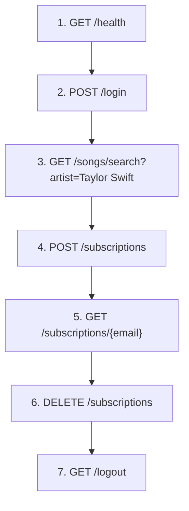

# Music Subscription Backend and Frontend — Deployment, Probing & Teardown Guide

> [!NOTE]
> This guide covers the **3 backend deployments** (EC2, ECS Fargate, API Gateway + Lambda) and the static frontend in [frontend/](frontend/). All work happens inside the **AWS Learner Lab** browser console in **`us-east-1`**.

---

## Table of Contents

1. [Shared Prerequisites](#shared-prerequisites)
2. [Frontend — EC2 + nginx](#frontend--ec2--nginx)
3. [Backend 1 — EC2 (Docker Container)](#backend-1--ec2-docker-container)
4. [Backend 2 — ECS Fargate (Managed Containers)](#backend-2--ecs-fargate-managed-containers)
5. [Backend 3 — API Gateway + Lambda (Serverless)](#backend-3--api-gateway--lambda-serverless)
6. [API Probing Cheat-Sheet](#api-probing-cheat-sheet)
7. [Cost-Control Reminders](#cost-control-reminders)

---

## Shared Prerequisites

These steps must be completed **once** before any of the 3 backends can function. Run them from **CloudShell** or an **EC2 Instance Connect** terminal inside the Learner Lab.

### P0. Deterministic Python & tooling (CloudShell)

See [exec log.md](exec%20log.md) **Section 1** for the tested CloudShell setup:
- Install `mise` for Python version management
- Install `uv` for tooling
- Set Python 3.12 as global default
- Clone repo and run `uv sync --no-dev`

Quick check: `python --version` returns `3.12.x` and `which python` points to a `mise`-managed path.

### P1. Start the Learner Lab session

1. Open **AWS Academy → Learner Lab** in your browser.
2. Click **Start Lab** — wait for the indicator to turn green.
3. Click **AWS** to open the AWS Console. Verify you are in **us-east-1** (N. Virginia).

### P2. Note your Account ID and LabRole ARN

```bash
# In CloudShell:
aws sts get-caller-identity --query Account --output text
# → your 12-digit ACCOUNT_ID

aws iam get-role --role-name LabRole --query Role.Arn --output text
# → arn:aws:iam::<ACCOUNT_ID>:role/LabRole
```

Write these down — every deploy step below references `<ACCOUNT_ID>` and `<LABROLE_ARN>`.

### P3. Create DynamoDB tables and S3 bucket (if not already done)

If the tables and bucket already exist from a prior session, skip this. Otherwise clone the repo into CloudShell and run:

```bash
# Clone repo (or upload a zip)
git clone <YOUR_REPO_URL> music-app && cd music-app

# Install deps
pip3 install boto3 tqdm requests

# Create tables & load data
python3 q1_create_login.py
python3 q2_create_music.py
python3 q3_load_music.py
python3 create_subscriptions_table.py
python3 q4_S3_images.py
```

> [!TIP]
> You can verify tables exist with:
> ```bash
> aws dynamodb list-tables --region us-east-1
> aws dynamodb scan --table-name login --select COUNT --region us-east-1
> aws dynamodb scan --table-name music --select COUNT --region us-east-1
> aws s3 ls s3://rmit-music-images-unique-91725/
> ```

### P4. Create ECR repository (shared by EC2 and ECS deployments)

```bash
aws ecr create-repository \
  --repository-name music-subscription-api \
  --region us-east-1
```

> [!NOTE]
> If it already exists, this will error — that's fine, move on.

### P5. Build and push the Docker image to ECR

See [exec log.md](exec%20log.md) **Section 2** for the tested builder approach:

1. Launch an EC2 builder instance (Amazon Linux / Fedora / RHEL).
2. Install Docker, Git, and AWS CLI.
3. Clone repo, set env vars (`ACCOUNT_ID`, `REGION`, `REPO_NAME`, `IMAGE_TAG`).
4. Run `docker build`, tag for ECR, and `docker push`.
5. Terminate builder when done.

The exec log section includes idempotent environment variable setup and explicit build/push steps. Repeat this flow for every new image version.

---

## Frontend — EC2 + nginx

Deploy the frontend on a small EC2 instance running nginx. This allows you to easily point at different backends using query parameters without re-uploading.

### Step F1 — Launch EC2 instance

1. **EC2 → Launch Instances**:

| Setting | Value |
|---|---|
| Name | `music-subscription-frontend-ec2` |
| AMI | Amazon Linux 2023 |
| Instance type | `t2.micro` |
| Key pair | `vockey` |
| Security Group | Create new: Allow **HTTP (port 80)** from `0.0.0.0/0` and **SSH (port 22)** from your IP |
| IAM instance profile | Not needed |

2. Click **Launch Instance**, wait for **Status Checks = 2/2 passed**.
3. Copy the **Public IPv4 DNS** (e.g., `ec2-XX-XX-XX-XX.compute-1.amazonaws.com`).

### Step F2 — Install nginx and deploy frontend

SSH or use **EC2 Instance Connect** to run:

```bash
# Update and install nginx
sudo yum update -y
sudo yum install -y nginx

# Start nginx
sudo systemctl start nginx
sudo systemctl enable nginx

# Copy frontend files to nginx directory
# (Option A: upload via Instance Connect file editor, then copy)
# (Option B: from local machine, use scp)
sudo cp ~/frontend/* /usr/share/nginx/html/
sudo chown -R nginx:nginx /usr/share/nginx/html/
```

### Step F3 — Access and configure backend URL

1. Open browser: `http://<EC2_PUBLIC_DNS>/`
2. To point at a backend, append the query parameter `?apiBase=<BACKEND_URL>`:

| Backend | Frontend URL |
|---|---|
| **EC2 backend** | `http://<EC2_FRONTEND_DNS>/?apiBase=http://<EC2_BACKEND_DNS>` |
| **ECS backend (ALB)** | `http://<EC2_FRONTEND_DNS>/?apiBase=http://<ALB_DNS>` |
| **Lambda backend (API GW)** | `http://<EC2_FRONTEND_DNS>/?apiBase=https://<api-id>.execute-api.us-east-1.amazonaws.com/prod` |

### Step F4 — Teardown EC2 frontend

```bash
aws ec2 terminate-instances --instance-ids <INSTANCE_ID> --region us-east-1
```

---

## Backend 1 — EC2 (Docker Container)

See [exec log.md](exec%20log.md) **Section 5** for the tested EC2 backend deployment:

1. In CloudShell, set env vars: `ACCOUNT_ID`, `S3_BUCKET`, `REGION`.
2. Launch EC2 instance (Amazon Linux 2023, `t2.micro` or larger, `LabInstanceProfile`).
3. Edit [deploy/ec2/user_data.sh](deploy/ec2/user_data.sh) with your env var values and paste into **User data**.
4. Wait for **Status Checks = 2/2 passed**.
5. Get the **Public IPv4 DNS** and test: `curl -s http://<DNS>/health`.
6. Expected: `{"status":"ok"}`.
7. Terminate when done.

---

## Backend 2 — ECS Fargate (Managed Containers)

See [exec log.md](exec%20log.md) **Section 6–7** for the tested ECS Fargate deployment:

1. In CloudShell, set env vars: `ACCOUNT_ID`, `CLUSTER_NAME`, `SERVICE_NAME`, `S3_BUCKET`, `REGION`, `TASK_DEFINITION`.
2. Create an ECS cluster (via AWS Console): Name `music-subscription-cluster`, Infrastructure: Fargate.
3. Create CloudWatch log group: `aws logs create-log-group --log-group-name /ecs/$TASK_DEFINITION`.
4. Get VPC, subnets, create security group, ALB, and target group (see exec log Section 6 for exact commands).
5. Store ALB DNS: `ALB_DNS=$(aws elbv2 describe-load-balancers --load-balancer-arns $ALB_ARN ...)`.
6. If first deployment, run `aws ecs create-service` once (exec log Section 6, Step 2.3).
7. Deploy: `bash deploy/ecs/deploy-ecs.sh --account-id $ACCOUNT_ID --cluster $CLUSTER_NAME --service $SERVICE_NAME --lab-role-arn arn:aws:iam::$ACCOUNT_ID:role/LabRole --bucket $S3_BUCKET --region $REGION`.
8. Test: `curl -s http://$ALB_DNS/health`.
9. Expected: `{"status":"ok"}`.

---

## Backend 3 — API Gateway + Lambda (Serverless)

### Step 3.1 — Environment variables & prerequisites

```bash
export ACCOUNT_ID=$(aws sts get-caller-identity --query Account --output text)
export S3_BUCKET="rmit-music-images-unique-91725"
export REGION="us-east-1"
export STACK_NAME="music-subscription-lambda"
export LAB_ROLE_ARN="arn:aws:iam::$ACCOUNT_ID:role/LabRole"
```

Install AWS SAM CLI if not already done:
```bash
sam --version  # Verify installation
```
Refer exec log.md file for the detailed execution of Lambda deployment.
 
### Step 3.2 — Build and deploy Lambda

From project root:

```bash
# Build
sam build -t deploy/lambda/template.yaml

# Deploy
sam deploy \
  --stack-name $STACK_NAME \
  --region $REGION \
  --capabilities CAPABILITY_IAM \
  --resolve-s3 \
  --parameter-overrides \
    LabRoleArn="$LAB_ROLE_ARN" \
    S3BucketName="$S3_BUCKET"
```

SAM prints the API Gateway URL in the output. Save it:
```bash
API_URL=$(aws cloudformation describe-stacks --stack-name $STACK_NAME --query "Stacks[0].Outputs[0].OutputValue" --output text --region $REGION)
echo $API_URL
```

### Step 3.3 — Verify and test

```bash
curl -s "$API_URL/health" | jq .
# Expected: {"status":"ok"}
```

### Step 3.4 — Teardown Lambda

```bash
sam delete --stack-name $STACK_NAME --region $REGION --no-prompts
```

---

## API Probing Cheat-Sheet

Replace `<BASE_URL>` with the appropriate URL for whichever backend you're testing.

### Browser-friendly GET endpoints (just paste into the address bar)

| Endpoint | URL |
|---|---|
| Health check | `<BASE_URL>/health` |
| Swagger UI (EC2/ECS direct only) | `<BASE_URL>/docs` |
| Search songs by artist | `<BASE_URL>/songs/search?artist=Taylor Swift` |
| Search songs by title + album | `<BASE_URL>/songs/search?title=Love Story&album=Fearless` |
| Search songs by year | `<BASE_URL>/songs/search?year=1974` |
| Search: artist + album | `<BASE_URL>/songs/search?artist=Jimmy Buffett&year=1974` |
| Get subscriptions | `<BASE_URL>/subscriptions/s41396730@student.rmit.edu.au` |
| Logout | `<BASE_URL>/logout` |

> [!NOTE]
> The Swagger UI (`/docs`) is generated by FastAPI and works with direct EC2/ECS URLs. Through API Gateway proxy, it may have issues loading the OpenAPI spec — use direct URLs when possible for interactive testing.

### POST / DELETE endpoints (use the Swagger UI, `curl`, or browser dev console)

#### Login

```bash
curl -X POST "<BASE_URL>/login" \
  -H "Content-Type: application/json" \
  -d '{"email": "s41396730@student.rmit.edu.au", "password": "012345"}'
```

#### Register

```bash
curl -X POST "<BASE_URL>/register" \
  -H "Content-Type: application/json" \
  -d '{"email": "newuser@test.com", "user_name": "TestUser", "password": "pass123"}'
```

#### Search songs (POST)

```bash
curl -X POST "<BASE_URL>/songs/search" \
  -H "Content-Type: application/json" \
  -d '{"artist": "Taylor Swift", "album": "Fearless"}'
```

#### Subscribe to a song

```bash
curl -X POST "<BASE_URL>/subscriptions" \
  -H "Content-Type: application/json" \
  -d '{
    "user_email": "s41396730@student.rmit.edu.au",
    "title": "Love Story",
    "artist": "Taylor Swift",
    "year": "2008",
    "album": "Fearless",
    "img_url": "Taylor_Swift.jpg"
  }'
```

#### Remove a subscription (body-based DELETE)

```bash
curl -X DELETE "<BASE_URL>/subscriptions" \
  -H "Content-Type: application/json" \
  -d '{
    "user_email": "s41396730@student.rmit.edu.au",
    "title": "Love Story",
    "album": "Fearless"
  }'
```

#### Remove a subscription (path-based DELETE)

```bash
curl -X DELETE "<BASE_URL>/subscriptions/s41396730@student.rmit.edu.au/Love%20Story%23Fearless"
```

### Recommended testing flow



---

## Cost-Control Reminders

> [!CAUTION]
> The Learner Lab has a fixed budget. Exceeding it **disables your account and deletes all resources**.

| Resource | Cost Risk | Action |
|---|---|---|
| EC2 instance | Medium | **Stop** when not testing, **Terminate** when done |
| ALB (for ECS) | **High** | Delete immediately after demo |
| ECS Fargate tasks | Medium | Scale to 0 or delete service |
| NAT Gateway | **High** | Should not be needed if using public subnets — verify none were auto-created |
| Lambda + API GW | **Low** | Pay-per-request; safe to leave deployed, but delete when done |
| ECR images | Low | Clean up old images periodically |
| DynamoDB tables | Low | On-demand/provisioned at 5 RCU/WCU — negligible |
| S3 bucket | Low | Negligible for image storage |

**After each testing session:**
1. Stop or terminate EC2 instances.
2. Delete ALBs and ECS services.
3. Delete CloudFormation stacks you no longer need.
4. Check **Tag Editor** or **Cost Explorer** for forgotten resources.
