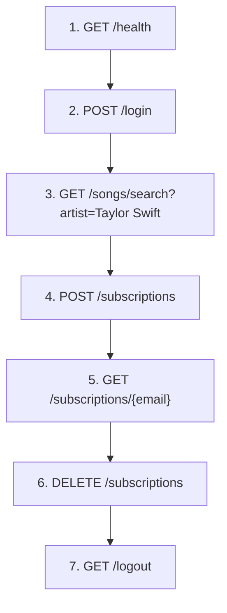

# Music Subscription Backend and Frontend — Deployment, Probing & Teardown Guide

> [!NOTE]
> This guide covers the **3 backend deployments** (EC2, ECS Fargate, API Gateway + Lambda) and the static frontend in [frontend/](frontend/). All work happens inside the **AWS Learner Lab** browser console in **`us-east-1`**.

---

## Table of Contents

1. [Shared Prerequisites](#shared-prerequisites)
2. [Frontend — EC2 + nginx](#frontend--ec2--nginx)
3. [Backend 1 — EC2 (Docker Container)](#backend-1--ec2-docker-container)
4. [Backend 2 — ECS Fargate (Managed Containers)](#backend-2--ecs-fargate-managed-containers)
5. [Backend 3 — API Gateway + Lambda (Serverless)](#backend-3--api-gateway--lambda-serverless)
6. [API Probing Cheat-Sheet](#api-probing-cheat-sheet)
7. [Cost-Control Reminders](#cost-control-reminders)

---

## Shared Prerequisites

These steps must be completed **once** before any of the 3 backends can function. Run them from **CloudShell** or an **EC2 Instance Connect** terminal inside the Learner Lab.

### P0. Deterministic Python & tooling (CloudShell / EC2)

These steps make CloudShell and temporary EC2 builders deterministic: confirm Python, attempt an `apt` install of Python 3.12, fall back to `mise` for pre-built Python versions, and use `pyenv` only if you explicitly need a source build. Persist init in `~/.bashrc`, install `uvicorn` for local app runs, create a virtualenv and run a smoke test. Each step includes a short deterministic check and remediation.

1) Verify current Python

```bash
python3 --version || python --version
python -c 'import sys; print(sys.version)'
which python || which python3
```

Expected: `Python 3.12.x` (or >= 3.12). If not present, continue below.

2) Try the system package manager first (`apt` in CloudShell)

```bash
# CloudShell uses apt; install the versioned Python packages if available
sudo apt-get update
sudo apt-get install -y python3.12 python3.12-venv python3.12-dev

# If installed, create venv and install deps
python3.12 -m venv .venv
source .venv/bin/activate
python -m pip install --upgrade pip
pip install -r requirements.txt uvicorn
```

Deterministic check: `python --version` returns `3.12.x` and `which python` ends in `/.venv/bin/python` after activation.
If `apt` cannot provide Python 3.12, fall back to the `mise` flow below.

3) `mise` flow (pre-built Python version; preferred fallback)

Follow the official `mise` install instructions if `mise` is not present. Then load it in the shell and install the pre-built Python version:

```bash
# Shell init for bash
eval "$(mise activate bash)"

# Install Python 3.12 via mise
mise install python@3.12.0
mise use --global python@3.12.0

# Verify
mise ls
mise current
which python
python --version
```

Deterministic check: `mise current` shows `python@3.12.0` and `python --version` prints `3.12.x`.

4) `pyenv` flow (source-build fallback)

If `mise` is not available, `pyenv` can build Python from source. This is slower and requires build dependencies. On CloudShell, use `apt`; on Amazon Linux EC2, swap these lines for the local distro package manager equivalents:

```bash
sudo apt-get update
sudo apt-get install -y git build-essential zlib1g-dev libbz2-dev libreadline-dev libsqlite3-dev libssl-dev tk-dev libffi-dev

curl https://pyenv.run | bash

# Add pyenv to the shell (see .bashrc snippet below)
export PATH="$HOME/.pyenv/bin:$PATH"
eval "$(pyenv init -)"
eval "$(pyenv virtualenv-init -)"
source ~/.bashrc

pyenv install 3.12.0
pyenv global 3.12.0

python -m venv .venv
source .venv/bin/activate
python -m pip install --upgrade pip
pip install -r requirements.txt uvicorn
```

Deterministic check: `pyenv versions` lists `3.12.0` as active and `python --version` prints `3.12.x`.

5) Persist environment (`~/.bashrc`) — idempotent snippet

Append (idempotently) the following to `~/.bashrc` so new shells pick up `mise`/`pyenv` automatically:

```bash
# >>> music-app environment helpers >>>
# mise init (if present)
if command -v mise >/dev/null 2>&1; then
  eval "$(mise activate bash)"
fi

# pyenv init (if installed)
if command -v pyenv >/dev/null 2>&1; then
  export PYENV_ROOT="$HOME/.pyenv"
  export PATH="$PYENV_ROOT/bin:$PATH"
  eval "$(pyenv init -)"
  eval "$(pyenv virtualenv-init -)"
fi
# >>> end music-app env >>>
```

Reload to apply:

```bash
source ~/.bashrc
exec $SHELL
```

Deterministic check: `grep -n "music-app environment helpers" ~/.bashrc` finds the snippet and `command -v pyenv || command -v mise` succeeds in the reloaded shell.

6) Create & activate a deterministic virtualenv (project root)

```bash
# From repo root
python -m venv .venv
source .venv/bin/activate
python -m pip install --upgrade pip
pip install -r requirements.txt uvicorn
```

Deterministic check: `which python` ends with `/.venv/bin/python` and `pip show uvicorn` prints a version.

7) Run the app with `uvicorn` as a deterministic smoke test

```bash
# Bind to 0.0.0.0 for EC2/CloudShell reachability
uvicorn app.main:app --host 0.0.0.0 --port 8000 --reload &
curl -sS http://127.0.0.1:8000/health
```

Expect: `{"status":"ok"}`. If the curl fails, check the `uvicorn` logs and Python import errors.

8) Quick checks & troubleshooting

- Confirm Python path and version:

```bash
which python
python --version
```

- `mise` quick list:

```bash
mise ls
mise current
```

- `pyenv` quick list:

```bash
pyenv versions
pyenv which python
```

- If `sudo dnf` fails in CloudShell (no privileges), use the builder EC2 approach (see Option B / builder workflow) and run installs there, or use the `mise`/`pyenv` user-space flows.

9) EC2 `user_data` recommendation (optional)

To have EC2 instances come up ready with Python 3.12 + `uvicorn`, add minimal, idempotent install and venv steps to `deploy/ec2/user_data.sh` so the VM can run the app locally for debugging. Example:

```bash
# (pseudo) in user_data.sh
if ! command -v python3.12 >/dev/null 2>&1; then
  sudo dnf install -y python3.12 python3.12-venv || sudo yum install -y python3.12 python3.12-venv || true
fi
cd /home/ec2-user/app || cd /opt/app || exit 0
python3.12 -m venv .venv || python -m venv .venv
source .venv/bin/activate
python -m pip install --upgrade pip
pip install -r /path/to/requirements.txt uvicorn
nohup uvicorn app.main:app --host 0.0.0.0 --port 8000 &
```

10) Checklist summary (for manual intervention points)

- `python --version` shows `3.12.x` or `mise`/`pyenv` pinned to 3.12
- `~/.bashrc` contains `mise`/`pyenv` init snippet and has been sourced
- Virtualenv exists (`.venv`) and `pip install -r requirements.txt` succeeded
- `uvicorn app.main:app` returns healthy `{"status":"ok"}`

If any check fails: capture the failing command output, revert the last change if needed, and retry the preferred install path (system → mise → pyenv).

### P1. Start the Learner Lab session

1. Open **AWS Academy → Learner Lab** in your browser.
2. Click **Start Lab** — wait for the indicator to turn green.
3. Click **AWS** to open the AWS Console. Verify you are in **us-east-1** (N. Virginia).

### P2. Note your Account ID and LabRole ARN

```bash
# In CloudShell:
aws sts get-caller-identity --query Account --output text
# → your 12-digit ACCOUNT_ID

aws iam get-role --role-name LabRole --query Role.Arn --output text
# → arn:aws:iam::<ACCOUNT_ID>:role/LabRole
```

Write these down — every deploy step below references `<ACCOUNT_ID>` and `<LABROLE_ARN>`.

### P3. Create DynamoDB tables and S3 bucket (if not already done)

If the tables and bucket already exist from a prior session, skip this. Otherwise clone the repo into CloudShell and run:

```bash
# Clone repo (or upload a zip)
git clone <YOUR_REPO_URL> music-app && cd music-app

# Install deps
pip3 install boto3 tqdm requests

# Create tables & load data
python3 q1_create_login.py
python3 q2_create_music.py
python3 q3_load_music.py
python3 create_subscriptions_table.py
python3 q4_S3_images.py
```

> [!TIP]
> You can verify tables exist with:
> ```bash
> aws dynamodb list-tables --region us-east-1
> aws dynamodb scan --table-name login --select COUNT --region us-east-1
> aws dynamodb scan --table-name music --select COUNT --region us-east-1
> aws s3 ls s3://rmit-music-images-unique-91725/
> ```

### P4. Create ECR repository (shared by EC2 and ECS deployments)

```bash
aws ecr create-repository \
  --repository-name music-subscription-api \
  --region us-east-1
```

> [!NOTE]
> If it already exists, this will error — that's fine, move on.

### P5. Build and push the Docker image to ECR

You need a Docker-capable environment. **CloudShell does NOT have Docker**. Options:
- **Option A** — Build locally on your Windows machine and push (requires AWS CLI configured with Learner Lab creds + Docker Desktop running).
- **Option B** — Launch a temporary EC2 instance (Amazon Linux 2, `t2.small`, attach `LabInstanceProfile`), SSH/Instance Connect in, clone repo, install Docker, build & push.

### Option A (local machine with Docker Desktop)

Use this if Docker Desktop is already running on your Windows machine:

```powershell
# 1. Get Learner Lab temporary credentials and configure AWS CLI locally
#    (copy AWS_ACCESS_KEY_ID, AWS_SECRET_ACCESS_KEY, AWS_SESSION_TOKEN
#     from Learner Lab → "AWS Details" → "AWS CLI")
$env:AWS_ACCESS_KEY_ID = "<paste>"
$env:AWS_SECRET_ACCESS_KEY = "<paste>"
$env:AWS_SESSION_TOKEN = "<paste>"
$env:AWS_DEFAULT_REGION = "us-east-1"

# 2. Get your Account ID
$ACCOUNT_ID = aws sts get-caller-identity --query Account --output text

# 3. ECR login
aws ecr get-login-password --region us-east-1 | docker login --username AWS --password-stdin "$ACCOUNT_ID.dkr.ecr.us-east-1.amazonaws.com"

# 4. Build image (from project root)
docker build -t music-subscription-api:latest .

# 5. Tag for ECR
docker tag music-subscription-api:latest "${ACCOUNT_ID}.dkr.ecr.us-east-1.amazonaws.com/music-subscription-api:latest"

# 6. Push
docker push "${ACCOUNT_ID}.dkr.ecr.us-east-1.amazonaws.com/music-subscription-api:latest"
```

> [!IMPORTANT]
> The image must be **linux/amd64** architecture. If you're on an ARM Mac, add `--platform linux/amd64` to the `docker build` command. On Windows/Intel, the default is correct.

### Option B (Automated Builder via CloudShell)

Use this if your team members are on different operating systems and cannot build locally. We use an automated script from AWS CloudShell to launch a temporary builder, connect, build, push, and cleanly tear it down.

#### B1. Clone this repository into CloudShell

Open AWS CloudShell. You will need your repository URL (HTTPS).

```bash
# 1. PASTE IN CLOUDSHELL
git clone <YOUR_REPO_URL> music-repo
cd music-repo
```

#### B2. Launch the temporary builder instance

We have provided a script that launches a temporary Amazon Linux 2023 instance, correctly configures its Security Groups, binds `LabInstanceProfile`, and passes a startup script that prepares Docker and the AWS CLI.

```bash
# 2. PASTE IN CLOUDSHELL
bash deploy/builder/launch_builder.sh
```

Wait for the script to finish. It will print instructions taking you to the next step, including your **Instance ID**.

#### B3. Connect inside the Builder

The setup script gives you a command to run. Paste it in CloudShell:

```bash
# 3. PASTE IN CLOUDSHELL (Replace with actual ID from previous step output)
aws ssm start-session --target i-0abcd1234567890ef --region us-east-1
```
*(No SSH keys are needed—we use secure AWS Systems Manager!)*

#### B4. Build and Push the image

Our builder script pre-loads a helper onto the temporary instance. While connected to the session (you should see a `sh-5.2$` or similar prompt), run:

```bash
# 4. PASTE IN SSM SESSION ON THE BUILDER
bash ~/build_and_push.sh
```

It will prompt you for your `REPO_URL`. Paste the HTTPS link to your git repository. It will clone the code, log into ECR, build the `music-subscription-api` Docker container, and securely push it.

#### B5. Teardown the temp builder (crucial to save lab budget)

When the push completes successfully:

```bash
# 5. PASTE IN SSM SESSION ON THE BUILDER (This exits the instance)
exit
```

Now, back in your **CloudShell**, copy-paste the teardown commands that the launch script provided earlier:

```bash
# 6. PASTE IN CLOUDSHELL to clean up
aws ec2 terminate-instances --instance-ids <YOUR_INSTANCE_ID> --region us-east-1
aws ec2 delete-security-group --group-id <YOUR_SG_ID> --region us-east-1 || true
```

> [!TIP]
> This entirely eliminates having to click through the AWS Console, keeps everyone on identical environments, and guarantees cost cleanup for ad-hoc builders!

---

## Frontend — EC2 + nginx

Deploy the frontend on a small EC2 instance running nginx. This allows you to easily point at different backends using query parameters without re-uploading.

### Step F1 — Launch EC2 instance

1. **EC2 → Launch Instances**:

| Setting | Value |
|---|---|
| Name | `music-subscription-frontend-ec2` |
| AMI | Amazon Linux 2023 |
| Instance type | `t2.micro` |
| Key pair | `vockey` |
| Security Group | Create new: Allow **HTTP (port 80)** from `0.0.0.0/0` and **SSH (port 22)** from your IP |
| IAM instance profile | Not needed |

2. Click **Launch Instance**, wait for **Status Checks = 2/2 passed**.
3. Copy the **Public IPv4 DNS** (e.g., `ec2-XX-XX-XX-XX.compute-1.amazonaws.com`).

### Step F2 — Install nginx and deploy frontend

SSH or use **EC2 Instance Connect** to run:

```bash
# Update and install nginx
sudo yum update -y
sudo yum install -y nginx

# Start nginx
sudo systemctl start nginx
sudo systemctl enable nginx

# Copy frontend files to nginx directory
# (Option A: upload via Instance Connect file editor, then copy)
# (Option B: from local machine, use scp)
sudo cp ~/frontend/* /usr/share/nginx/html/
sudo chown -R nginx:nginx /usr/share/nginx/html/
```

### Step F3 — Access and configure backend URL

1. Open browser: `http://<EC2_PUBLIC_DNS>/`
2. To point at a backend, append the query parameter `?apiBase=<BACKEND_URL>`:

| Backend | Frontend URL |
|---|---|
| **EC2 backend** | `http://<EC2_FRONTEND_DNS>/?apiBase=http://<EC2_BACKEND_DNS>` |
| **ECS backend (ALB)** | `http://<EC2_FRONTEND_DNS>/?apiBase=http://<ALB_DNS>` |
| **Lambda backend (API GW)** | `http://<EC2_FRONTEND_DNS>/?apiBase=https://<api-id>.execute-api.us-east-1.amazonaws.com/prod` |

### Step F4 — Teardown EC2 frontend

```bash
aws ec2 terminate-instances --instance-ids <INSTANCE_ID> --region us-east-1
```

---

## Backend 1 — EC2 (Docker Container)

### Step 1.1 — Environment variables & prerequisites

Before launching, set these environment variables in your CloudShell or terminal:

```bash
export ACCOUNT_ID=$(aws sts get-caller-identity --query Account --output text)
export S3_BUCKET="rmit-music-images-unique-91725"
export REGION="us-east-1"
export BACKEND_PORT="80"
```

### Step 1.2 — Launch the EC2 instance

From **EC2 → Launch Instances**:

| Setting | Value |
|---|---|
| Name | `music-subscription-ec2-backend` |
| AMI | Amazon Linux 2023 |
| Instance type | `t2.small` |
| Key pair | `vockey` |
| Security Group | Create new: Allow **HTTP (port 80)** from `0.0.0.0/0` |
| IAM instance profile | `LabInstanceProfile` |
| User data | See Step 1.3 |

### Step 1.3 — User data script

Use [deploy/ec2/user_data.sh](deploy/ec2/user_data.sh). Before pasting, replace:
- `CHANGE_ME_ACCOUNT_ID` → `$ACCOUNT_ID`
- `CHANGE_ME_BUCKET` → `$S3_BUCKET`

Then paste into the **User data** field.

### Step 1.4 — Verify deployment

1. Wait for **Status Checks = 2/2 passed**.
2. Get the **Public IPv4 DNS**: `EC2_PUBLIC_DNS=<value>`
3. Test:

```bash
curl -s http://$EC2_PUBLIC_DNS/health | jq .
# Expected: {"status":"ok"}
```

### Step 1.5 — Teardown

```bash
aws ec2 terminate-instances --instance-ids <INSTANCE_ID> --region $REGION
```

---

## Backend 2 — ECS Fargate (Managed Containers)

### Step 2.1 — Environment variables & prerequisites

```bash
export ACCOUNT_ID=$(aws sts get-caller-identity --query Account --output text)
export CLUSTER_NAME="music-subscription-cluster"
export SERVICE_NAME="music-subscription-service"
export S3_BUCKET="rmit-music-images-unique-91725"
export REGION="us-east-1"
export TASK_DEFINITION="music-subscription-api"
```

### Step 2.2 — Create ECS cluster & networking

1. **Create ECS cluster** (via Console or AWS SDK):
   - Name: `music-subscription-cluster`
   - Infrastructure: Fargate

2. **Create CloudWatch Log Group**:
```bash
aws logs create-log-group --log-group-name /ecs/$TASK_DEFINITION --region $REGION
```

3. **Get VPC and subnets**:
```bash
VPC_ID=$(aws ec2 describe-vpcs --filters Name=isDefault,Values=true --query "Vpcs[0].VpcId" --output text)
SUBNET_IDS=$(aws ec2 describe-subnets --filters Name=vpc-id,Values=$VPC_ID --query "Subnets[0:2].SubnetId" --output text)
```

4. **Create Security Group**:
```bash
SG_ID=$(aws ec2 create-security-group --group-name ecs-music-sg --description "ECS backend" --vpc-id $VPC_ID --query GroupId --output text --region $REGION)
aws ec2 authorize-security-group-ingress --group-id $SG_ID --protocol tcp --port 80 --cidr 0.0.0.0/0 --region $REGION
```

5. **Create ALB and Target Group**:
```bash
ALB_ARN=$(aws elbv2 create-load-balancer --name music-sub-alb --subnets $SUBNET_IDS --security-groups $SG_ID --scheme internet-facing --type application --query "LoadBalancers[0].LoadBalancerArn" --output text --region $REGION)
TG_ARN=$(aws elbv2 create-target-group --name music-sub-tg --protocol HTTP --port 80 --vpc-id $VPC_ID --target-type ip --health-check-path /health --query "TargetGroups[0].TargetGroupArn" --output text --region $REGION)
aws elbv2 create-listener --load-balancer-arn $ALB_ARN --protocol HTTP --port 80 --default-actions Type=forward,TargetGroupArn=$TG_ARN --region $REGION
```

6. **Get ALB DNS**:
```bash
ALB_DNS=$(aws elbv2 describe-load-balancers --load-balancer-arns $ALB_ARN --query "LoadBalancers[0].DNSName" --output text --region $REGION)
echo $ALB_DNS
```

### Step 2.3 — Deploy ECS service

Use [deploy/ecs/deploy-ecs.sh](deploy/ecs/deploy-ecs.sh) with env vars:

```bash
bash deploy/ecs/deploy-ecs.sh \
  --account-id $ACCOUNT_ID \
  --cluster $CLUSTER_NAME \
  --service $SERVICE_NAME \
  --lab-role-arn "arn:aws:iam::$ACCOUNT_ID:role/LabRole" \
  --bucket $S3_BUCKET \
  --region $REGION
```

### Step 2.4 — Verify and test

```bash
curl -s http://$ALB_DNS/health | jq .
# Expected: {"status":"ok"}
```

### Step 2.5 — Teardown ECS

```bash
aws ecs update-service --cluster $CLUSTER_NAME --service $SERVICE_NAME --desired-count 0 --region $REGION
aws ecs delete-service --cluster $CLUSTER_NAME --service $SERVICE_NAME --force --region $REGION
aws elbv2 delete-load-balancer --load-balancer-arn $ALB_ARN --region $REGION
aws elbv2 delete-target-group --target-group-arn $TG_ARN --region $REGION
aws ec2 delete-security-group --group-id $SG_ID --region $REGION
aws ecs delete-cluster --cluster $CLUSTER_NAME --region $REGION
aws logs delete-log-group --log-group-name /ecs/$TASK_DEFINITION --region $REGION
```

---

## Backend 3 — API Gateway + Lambda (Serverless)

### Step 3.1 — Environment variables & prerequisites

```bash
export ACCOUNT_ID=$(aws sts get-caller-identity --query Account --output text)
export S3_BUCKET="rmit-music-images-unique-91725"
export REGION="us-east-1"
export STACK_NAME="music-subscription-lambda"
export LAB_ROLE_ARN="arn:aws:iam::$ACCOUNT_ID:role/LabRole"
```

Install AWS SAM CLI if not already done:
```bash
sam --version  # Verify installation
```

### Step 3.2 — Build and deploy Lambda

From project root:

```bash
# Build
sam build -t deploy/lambda/template.yaml

# Deploy
sam deploy \
  --stack-name $STACK_NAME \
  --region $REGION \
  --capabilities CAPABILITY_IAM \
  --resolve-s3 \
  --parameter-overrides \
    LabRoleArn="$LAB_ROLE_ARN" \
    S3BucketName="$S3_BUCKET"
```

SAM prints the API Gateway URL in the output. Save it:
```bash
API_URL=$(aws cloudformation describe-stacks --stack-name $STACK_NAME --query "Stacks[0].Outputs[0].OutputValue" --output text --region $REGION)
echo $API_URL
```

### Step 3.3 — Verify and test

```bash
curl -s "$API_URL/health" | jq .
# Expected: {"status":"ok"}
```

### Step 3.4 — Teardown Lambda

```bash
sam delete --stack-name $STACK_NAME --region $REGION --no-prompts
```

---

## API Probing Cheat-Sheet

Replace `<BASE_URL>` with the appropriate URL for whichever backend you're testing.

### Browser-friendly GET endpoints (just paste into the address bar)

| Endpoint | URL |
|---|---|
| Health check | `<BASE_URL>/health` |
| Swagger UI (EC2/ECS direct only) | `<BASE_URL>/docs` |
| Search songs by artist | `<BASE_URL>/songs/search?artist=Taylor Swift` |
| Search songs by title + album | `<BASE_URL>/songs/search?title=Love Story&album=Fearless` |
| Search songs by year | `<BASE_URL>/songs/search?year=1974` |
| Search: artist + album | `<BASE_URL>/songs/search?artist=Jimmy Buffett&year=1974` |
| Get subscriptions | `<BASE_URL>/subscriptions/s41396730@student.rmit.edu.au` |
| Logout | `<BASE_URL>/logout` |

> [!NOTE]
> The Swagger UI (`/docs`) is generated by FastAPI and works with direct EC2/ECS URLs. Through API Gateway proxy, it may have issues loading the OpenAPI spec — use direct URLs when possible for interactive testing.

### POST / DELETE endpoints (use the Swagger UI, `curl`, or browser dev console)

#### Login

```bash
curl -X POST "<BASE_URL>/login" \
  -H "Content-Type: application/json" \
  -d '{"email": "s41396730@student.rmit.edu.au", "password": "012345"}'
```

#### Register

```bash
curl -X POST "<BASE_URL>/register" \
  -H "Content-Type: application/json" \
  -d '{"email": "newuser@test.com", "user_name": "TestUser", "password": "pass123"}'
```

#### Search songs (POST)

```bash
curl -X POST "<BASE_URL>/songs/search" \
  -H "Content-Type: application/json" \
  -d '{"artist": "Taylor Swift", "album": "Fearless"}'
```

#### Subscribe to a song

```bash
curl -X POST "<BASE_URL>/subscriptions" \
  -H "Content-Type: application/json" \
  -d '{
    "user_email": "s41396730@student.rmit.edu.au",
    "title": "Love Story",
    "artist": "Taylor Swift",
    "year": "2008",
    "album": "Fearless",
    "img_url": "Taylor_Swift.jpg"
  }'
```

#### Remove a subscription (body-based DELETE)

```bash
curl -X DELETE "<BASE_URL>/subscriptions" \
  -H "Content-Type: application/json" \
  -d '{
    "user_email": "s41396730@student.rmit.edu.au",
    "title": "Love Story",
    "album": "Fearless"
  }'
```

#### Remove a subscription (path-based DELETE)

```bash
curl -X DELETE "<BASE_URL>/subscriptions/s41396730@student.rmit.edu.au/Love%20Story%23Fearless"
```

### Recommended testing flow



---

## Cost-Control Reminders

> [!CAUTION]
> The Learner Lab has a fixed budget. Exceeding it **disables your account and deletes all resources**.

| Resource | Cost Risk | Action |
|---|---|---|
| EC2 instance | Medium | **Stop** when not testing, **Terminate** when done |
| ALB (for ECS) | **High** | Delete immediately after demo |
| ECS Fargate tasks | Medium | Scale to 0 or delete service |
| NAT Gateway | **High** | Should not be needed if using public subnets — verify none were auto-created |
| Lambda + API GW | **Low** | Pay-per-request; safe to leave deployed, but delete when done |
| ECR images | Low | Clean up old images periodically |
| DynamoDB tables | Low | On-demand/provisioned at 5 RCU/WCU — negligible |
| S3 bucket | Low | Negligible for image storage |

**After each testing session:**
1. Stop or terminate EC2 instances.
2. Delete ALBs and ECS services.
3. Delete CloudFormation stacks you no longer need.
4. Check **Tag Editor** or **Cost Explorer** for forgotten resources.
